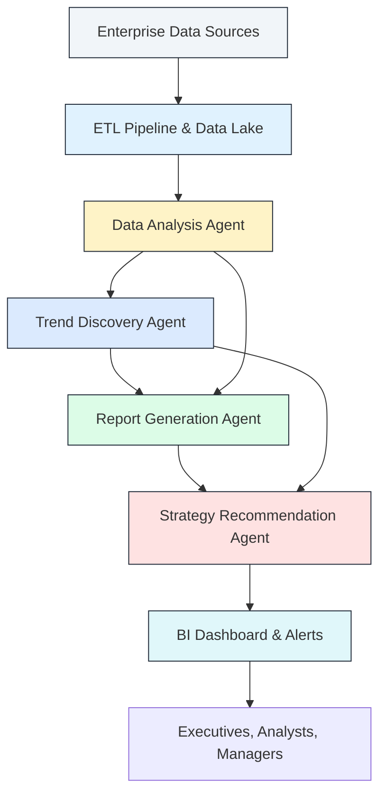
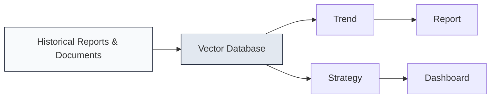
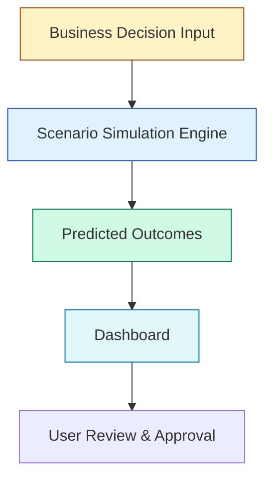

# Project 1: Autonomous Business Intelligence using Agentic AI

## Problem Statement
Enterprises generate massive volumes of data across sales, finance, marketing, and operations. However, deriving actionable intelligence from this data remains slow, manual, and often inconsistent. Business leaders need real-time insights, trend identification, and strategic recommendations to make informed decisions. Traditional BI tools are reactive, requiring human analysts for data extraction, reporting, and interpretation.

## Objective
This project seeks to build an autonomous AI-driven business intelligence system that can analyze enterprise data continuously. The system should generate insights, reports, and recommendations with minimal human intervention. It should support strategic decision-making for C-level executives and business managers. The overall goal is to move BI from reactive reporting to proactive guidance.

## Solution Overview
The solution combines data integration, multi-agent AI orchestration, semantic knowledge, and interactive visualization. It is designed to unify disparate data sources into a single intelligence fabric. This platform can detect trends, explain discoveries, and recommend business strategies. It also ensures enterprise-ready deployment, security, and governance.

### 1. Data Collection & Integration
The first phase focuses on connecting enterprise data from multiple systems and repositories. ETL processes ingest ERP, CRM, finance, operations, and cloud data into a secure lake. Data is cleansed, normalized, and enriched with business metadata to ensure consistency. Continuous ingestion pipelines handle both batch loads and streaming updates. This layer provides the foundation for all downstream intelligence.

### 2. ETL and Data Lake Architecture
Data is pulled from heterogeneous sources and transformed into standard business entities. The ETL pipelines perform schema mapping, deduplication, and validation against business rules. Unstructured content is processed through OCR, NLP, and metadata extraction. The Azure Data Lake stores raw and curated layers for auditability. This structure enables repeatable analytics and rapid data discovery.

### 3. Multi-Agent AI Architecture
A multi-agent architecture is used to divide responsibilities and increase robustness. Each agent specializes in a discrete step of the BI workflow. This design makes the system easier to maintain and extend. Agents also work together to produce richer outcomes than a single monolithic model. The orchestration layer coordinates their actions and data exchange.

### 4. Agent Roles and Responsibilities
A set of agents is defined to handle analysis, trend detection, reporting, and recommendations. The Data Analysis Agent focuses on cleaning and summarizing data into KPIs. The Trend Discovery Agent examines patterns and flags opportunities or risks. The Report Generation Agent produces narratives and visual summaries. The Strategy Recommendation Agent converts findings into actionable plans.

### 5. Data Analysis Agent Details
The Data Analysis Agent is the core analytics engine for the platform. It ingests cleaned data and computes key performance indicators. It applies statistical analysis, segmentation, and correlation detection. It generates datasets that the other agents use for deeper reasoning. The outputs include anomaly flags, summary tables, and feature-rich metrics.

### 6. Trend Discovery Agent Details
The Trend Discovery Agent searches for changes in behavior, seasonality, and sudden shifts. It uses historical baselines and time series modeling to identify unusual events. It also evaluates emerging opportunities and sector-specific signals. The agent tags trends by priority and confidence. This output helps executives focus on the most important developments.

### 7. Report Generation Agent Details
The Report Generation Agent translates technical findings into business stories. It creates executive briefings, dashboards, and visual artifacts. It writes clear narrative summaries that explain why an insight matters. It also generates charts and KPI widgets for decision makers. The agent ensures that reports are both precise and accessible.

### 8. Strategy Recommendation Agent Details
The Strategy Recommendation Agent turns observations into action. It uses predictive models, business rules, and risk assessments to propose decisions. It can recommend revenue-growth initiatives, cost optimization plans, and operational interventions. It also ranks options by expected impact, feasibility, and alignment with goals. This agent helps close the loop from insight to execution.

### 9. Agent Communication and Coordination
Agents communicate through a LangChain orchestration layer that manages workflows. They exchange structured data objects and natural language summaries. This enables the system to combine the strengths of specialized agents. Communication is logged for observability and later review. Coordination also supports iterative refinement of insights.

### 10. Autonomous Workflow Description
The autonomous workflow connects data to decisions without manual handoffs. Data flows from source systems into the ETL layer continuously or on schedule. Agents process the data in stages, each adding value and context. The final output is delivered as reports, recommendations, and alerts. This workflow is designed to reduce latency between insight and action.

### 11. Semantic Enrichment and Memory
A semantic index is built from historical reports, documents, and prior decisions. This index is stored in a vector database for rapid retrieval. Agents consult the semantic memory to understand what has worked before. This improves consistency and reduces repeated evaluation of the same issues. It also preserves institutional knowledge in the AI system.

### 12. Prompt Engineering & Domain Alignment
The agents are guided by prompts that encode business KPIs and domain knowledge. These prompts are tuned for the client’s industry and strategic priorities. They help the AI interpret data in a business context. They also ensure recommendations are aligned with stakeholder expectations. Prompt engineering is maintained as a living asset.

### 13. Dashboard and Executive Experience
The dashboard presents a unified view of current performance and strategic recommendations. It is designed for executives, analysts, and operational managers. Real-time KPI cards, trend lines, and narrative summaries are shown together. Users can drill into underlying data and view supporting evidence. Interactive controls allow exploration of scenarios and business levers.

### 14. Scenario Simulation Flow
Scenario simulation lets users explore “what-if” decisions before acting. Executives can change assumptions, budgets, or pricing levers. The system recalculates expected outcomes and highlights risk/reward tradeoffs. It generates a comparative summary of each scenario. This helps leaders understand the implications of their choices.

### 15. Deployment Infrastructure Details
The platform is hosted on Azure with containerized services for scaling. Each agent runs as a microservice in Docker containers. REST APIs expose data, insights, and recommendations to dashboards and external systems. Azure Cognitive Search powers semantic retrieval for the reasoning pipeline. Azure Cosmos DB stores vector embeddings and metadata for fast access.

### 16. Security and Governance
Enterprise authentication and role-based access control protect the system. Sensitive data is encrypted in transit and at rest. Audit logs capture data access, agent decisions, and user actions. Policy gates ensure that recommendations comply with business standards. Governance is built into the workflow so the AI operates within approved boundaries.

### 17. Monitoring and Reliability
The platform includes monitoring for system health, data quality, and insight accuracy. Telemetry tracks agent performance, latency, and failure rates. Alerting notifies engineers when data pipelines or services degrade. Monitoring also measures the business impact of recommendations. This ensures the system remains reliable and trustworthy.

### 18. End User Roles and Experience
Different users consume the system in tailored ways. Executives receive high-level summaries and strategy recommendations. Business analysts validate insights, explore data, and provide feedback. Operational managers monitor KPIs and trigger responsive actions. The system is designed to support each role with the right level of detail.

### 19. Business Value Realization
The autonomous BI platform reduces manual reporting work and accelerates decision cycles. It enables faster reaction to market shifts and operational issues. It improves strategy execution by providing data-backed recommendations. It also scales more easily than traditional BI teams. The result is a measurable uplift in efficiency and business outcomes.

### 20. Continuous Improvement and Future Readiness
The system is built to learn from outcomes and improve over time. Feedback from users and performance metrics is fed back into the agents. New data sources can be added without major redesign. The architecture supports evolving business needs and expanding use cases. This creates a future-ready intelligence platform for the enterprise.

## Component Tables
### Agent Component Table
| Component | Purpose | Key Inputs | Key Outputs | Notes |
|---|---|---|---|---|
| Data Analysis Agent | Extracts metrics, identifies signals, computes KPIs | Raw enterprise data, schema definitions | Aggregated datasets, KPI tables | First step in insight generation |
| Trend Discovery Agent | Detects anomalies and opportunities | Historical metrics, current performance | Trend reports, anomaly alerts | Supports proactive decision-making |
| Report Generation Agent | Creates narrative insights and visual summaries | Trend signals, KPI snapshots | Executive reports, dashboards, summaries | Ensures readability and business context |
| Strategy Recommendation Agent | Recommends actions and scenarios | Insights, forecast models, business goals | Decision recommendations, scenario outcomes | Focuses on operational and strategic impact |

### Functional Flow Table
| Stage | Description | Agents Involved | Outcome |
|---|---|---|---|
| Data Ingestion | Collect, clean, and store data | ETL pipelines | Trusted enterprise dataset |
| Semantic Indexing | Embed documents and prior reports | Vector database | Context-aware knowledge retrieval |
| Analysis | Compute KPIs and identify patterns | Data Analysis Agent | Metric summaries and signal generation |
| Trend Detection | Discover anomalies and seasonal shifts | Trend Discovery Agent | Alerts and opportunity signals |
| Reporting | Build executive-ready content | Report Generation Agent | Visuals, narratives, dashboards |
| Recommendation | Suggest business actions | Strategy Recommendation Agent | Action plans and strategic guidance |
| Delivery | Publish to dashboards and alerts | API + UI | Real-time insights to users |

## Tools & Technologies
- Programming & ML: Python, OpenAI GPT, LangChain
- Databases: Azure Data Lake, Azure Cosmos DB (vector storage), SQL Server
- Deployment & Cloud: Azure OpenAI Service, Docker, REST APIs, Azure Kubernetes Service
- BI & Visualization: Power BI, Plotly, Dash
- Orchestration & Automation: Multi-agent system design, LangChain workflows, event-driven scheduling
- Data Quality & Governance: Metadata catalogs, schema validation, audit logging
- Security & Compliance: Azure Active Directory, managed identities, role-based access controls

## End Users
- **C-Level Executives:** Receive autonomous insights and actionable recommendations to guide strategic planning.
- **Business Analysts:** Verify nsights, understand trends, and explore AI-generated forecasts.
- **Operational Managers:** Access targeted operational KPIs and real-time monitoring for quick decision-making.
- **Data Engineers:** Manage ingestion pipelines, maintain semantic indexes, and ensure data reliability.
- **Product Owners:** Review the system’s recommendations and translate them into prioritized execution plans.

## Business Impact
- Reduced dependency on manual BI reporting by over 70%, freeing analysts for higher-value strategic tasks.
- Accelerated decision-making with real-time insights, enabling rapid response to market changes.
- Improved strategy effectiveness through AI-driven recommendations, leading to measurable gains in revenue optimization and cost savings.
- Delivered a scalable solution capable of integrating new data sources and adapting to evolving business needs without additional human effort.
- Increased transparency by surfacing reasoning and evidence for recommendations, improving stakeholder trust.
- Reduced time to insight from days to minutes by automating analysis and report creation.
- Strengthened operational resilience through continuous monitoring of anomalies and risk signals.

## Deployment Environment
- Fully hosted on Azure, with AI agents running in containers for horizontal scaling.
- Connected to enterprise data sources via secure, automated ETL pipelines.
- Interactive dashboards accessible via web and mobile for executives and managers.
- Continuous monitoring and logging for agent performance, insight accuracy, and system reliability.
- Utilizes CI/CD pipelines for frequent updates and rapid deployment of new analytics capabilities.
- Implements environment separation for development, staging, and production workloads.

## Additional Project Details
- The platform supports both batch and real-time processing modes based on business needs.
- It includes an internal knowledge base for storing prior decisions, outcome metrics, and recommended actions.
- It can be extended to support additional enterprise domains like HR, supply chain, and customer support.
- The system is designed for future integration with Microsoft Fabric or other enterprise semantic analytics platforms.
- It can incorporate external third-party data sources such as market research feeds, competitor intelligence, and economic indicators.
- It offers automated alerting when KPIs cross predefined thresholds or when emerging risks are detected.

## Sources and References
- Azure Data Lake documentation: https://learn.microsoft.com/azure/storage/data-lake-storage
- Azure OpenAI Service overview: https://learn.microsoft.com/azure/cognitive-services/openai/overview
- LangChain documentation: https://langchain.com/docs/
- OpenAI API reference: https://platform.openai.com/docs/api-reference
- Azure Cognitive Search: https://learn.microsoft.com/azure/search/search-what-is-azure-search
- Azure Cosmos DB vector search: https://learn.microsoft.com/azure/cosmos-db/vector-search
- Power BI enterprise analytics: https://powerbi.microsoft.com/
- Docker containerization: https://www.docker.com/
- Best practices for BI automation and analytics operations
- Industry research on autonomous decision-making and AI-driven business intelligence
