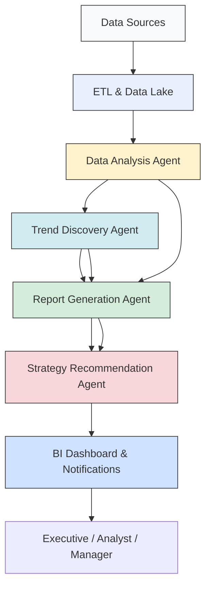
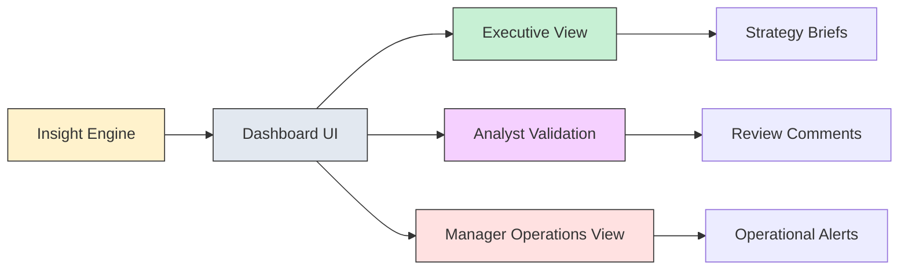

# Project 1: Autonomous Business Intelligence using Agentic AI

## Problem Statement
Enterprises generate massive volumes of data across sales, finance, marketing, and operations. However, deriving actionable intelligence from this data remains slow, manual, and often inconsistent. Business leaders need real-time insights, trend identification, and strategic recommendations to make informed decisions—but traditional BI tools are reactive, requiring human analysts for data extraction, reporting, and interpretation.

## Objective
Build an autonomous AI-driven business intelligence system capable of:

1. Automatically analyzing enterprise data across multiple sources.
2. Generating insights, reports, and recommendations with minimal human intervention.
3. Supporting strategic decision-making for C-level executives and business managers.

## Solution Overview
This solution transforms enterprise data into strategic intelligence using an end-to-end autonomous workflow. It combines data integration, multi-agent AI orchestration, semantic understanding, advanced visualization, and enterprise-grade deployment.

### 1. Data Collection & Integration
- Connected multiple internal data sources: ERP systems, CRM platforms, transactional databases, and cloud storage.
- Built ETL pipelines to standardize, clean, and consolidate structured and unstructured data.
- Leveraged Azure Data Lake for secure storage and seamless scaling of enterprise data.
- Included metadata tagging, schema mapping, and data quality validation for accurate insight generation.

### 2. Multi-Agent AI Architecture
The system is built on a multi-agent architecture where each agent has a clearly defined role and autonomy to collaborate.

#### Agent Roles and Responsibilities
| Agent | Responsibility | Input | Output |
|---|---|---|---|
| Data Analysis Agent | Performs exploratory data analysis, assembles datasets, computes KPIs and metrics. | Raw ERP, CRM, finance, operations data | Cleaned analytical datasets, metric summaries, anomaly flags |
| Trend Discovery Agent | Detects anomalies, seasonal patterns, and emerging opportunities. | Aggregated metrics, historical records, semantic context | Trend insights, anomaly reports, opportunity signals |
| Report Generation Agent | Generates executive-ready narratives, visualizations, and summary dashboards. | Insight summaries, visual assets, business context | Reports, slide decks, dashboard widgets, executive narratives |
| Strategy Recommendation Agent | Suggests business strategies, optimization actions, and risk mitigation plans. | Trend signals, KPI gaps, predictive model output | Action plans, scenario recommendations, prioritized next steps |

#### Agent Communication Flow
Agents communicate through a LangChain orchestration layer, exchanging structured observations, hypotheses, and action requests. This enables the system to act as a cohesive team rather than isolated components.

#### Agent Collaboration and Feedback Loop
- The Data Analysis Agent performs the first pass of structured insight extraction.
- The Trend Discovery Agent refines the analysis by identifying patterns and exceptions.
- The Report Generation Agent translates insights into executive summaries.
- The Strategy Recommendation Agent applies predictive reasoning, business rules, and KPI alignment to generate actions.
- A continuous feedback loop captures executive feedback and performance metrics, which is stored in the knowledge base for future learning.

### 3. AI Workflows & Automation
The solution automates the full BI workflow from data ingestion to decision recommendations.

#### Core Autonomous Workflow Steps
1. **Data Intake**: Extract data from ERP, CRM, sales, marketing, operations, and cloud storage.
2. **Data Preparation**: Cleanse, normalize, enrich, and store data in Azure Data Lake.
3. **Analytical Processing**: Run automated analytics and transformation pipelines.
4. **Semantic Enrichment**: Index historical reports, documents, and knowledge artifacts into a vector database.
5. **Insight Generation**: Use agentic reasoning to derive insights, trends, and risk factors.
6. **Report Assembly**: Generate narrative summaries, charts, and KPI dashboards.
7. **Strategy Recommendation**: Create targeted recommendations, scenario evaluations, and action plans.
8. **Delivery**: Publish results to dashboards, email alerts, or executive mobile summaries.

#### Automation Details
- Prompt engineering guides each agent toward domain-specific business outcomes.
- Vector search improves context retrieval for prior intelligence and similar historical cases.
- Orchestrated workflows support scheduled, event-triggered, and query-driven execution.
- Monitoring and logging capture agent decisions, data lineage, and model outputs for auditability.

### 4. Dashboard & Visualization
A unified executive dashboard presents insights, trend analysis, and strategic advice in one interface.

#### Dashboard Features
- Real-time KPI cards and trend tiles.
- Dynamic business narratives generated by GPT.
- Scenario simulation controls for “what-if” planning.
- Drill-down charts for finance, sales, marketing, and operations.
- Insight validation panels for analysts to review AI rationale.

#### Visual Flow Diagram

### 5. Deployment & Infrastructure
The system is deployed for enterprise reliability and scalability.

#### Infrastructure Components
- **Azure OpenAI Service**: Hosts GPT-based agent reasoning.
- **Docker Containers**: Package AI agents and services for portability.
- **REST APIs**: Connect dashboards, data sources, and orchestration services.
- **Azure Cognitive Search**: Enables semantic retrieval for contextual reasoning.
- **Azure Cosmos DB Vector Storage**: Stores vector embeddings for knowledge search.

#### Deployment Flow
1. Containerize agent services and pipelines.
2. Deploy distributed services on Azure Kubernetes Service or App Service.
3. Secure connections with managed identities and enterprise authentication.
4. Connect live ETL pipelines to Azure Data Lake and downstream BI services.
5. Monitor health, latency, and insight accuracy using centralized logs.

## Detailed System Architecture
This section explains how components interact in detail.

### Data Source and Ingestion
- ERP, CRM, and transactional databases push data into ETL workflows.
- Files and unstructured content are ingested from cloud storage and knowledge repositories.
- Metadata tagging and schema mapping ensure data is normalized for analysis.

### Semantic Knowledge Base
- Historical BI reports and insights are embedded into a vector store.
- Agents use semantic search to understand past decisions and reuse proven strategies.
- This knowledge base improves recommendation relevance and reduces redundant analysis.

### Agent Decisioning and Governance
- Each agent logs decisions, confidence scores, and reasoning paths.
- Governance rules ensure recommendations align with executive priorities and compliance policies.
- Feedback is captured to refine prompts, update business KPIs, and adjust model behavior.

## Component Tables
### Agent Component Table
| Component | Purpose | Key Inputs | Key Outputs | Notes |
|---|---|---|---|---|
| Data Analysis Agent | Extracts metrics, identifies signals, computes KPIs | Raw enterprise data, schema definitions | Aggregated datasets, KPI tables | First step in insight generation |
| Trend Discovery Agent | Detects anomalies and opportunities | Historical metrics, current performance | Trend reports, anomaly alerts | Supports proactive decision-making |
| Report Generation Agent | Creates narrative insights and visual summaries | Trend signals, KPI snapshots | Executive reports, dashboards, summaries | Ensures readability and business context |
| Strategy Recommendation Agent | Recommends actions and scenarios | Insights, forecast models, business goals | Decision recommendations, scenario outcomes | Focuses on operational and strategic impact |

### Functional Flow Table
| Stage | Description | Agents Involved | Outcome |
|---|---|---|---|
| Data Ingestion | Collect, clean, and store data | ETL pipelines | Trusted enterprise dataset |
| Semantic Indexing | Embed documents and prior reports | Vector database | Context-aware knowledge retrieval |
| Analysis | Compute KPIs and identify patterns | Data Analysis Agent | Metric summaries and signal generation |
| Trend Detection | Discover anomalies and seasonal shifts | Trend Discovery Agent | Alerts and opportunity signals |
| Reporting | Build executive-ready content | Report Generation Agent | Visuals, narratives, dashboards |
| Recommendation | Suggest business actions | Strategy Recommendation Agent | Action plans and strategic guidance |
| Delivery | Publish to dashboards and alerts | API + UI | Real-time insights to users |

## Tools & Technologies
- Programming & ML: Python, OpenAI GPT, LangChain
- Databases: Azure Data Lake, Azure Cosmos DB (vector storage), SQL Server
- Deployment & Cloud: Azure OpenAI Service, Docker, REST APIs, Azure Kubernetes Service
- BI & Visualization: Power BI, Plotly, Dash
- Orchestration & Automation: Multi-agent system design, LangChain workflows, event-driven scheduling

## End Users
- **C-Level Executives:** Receive autonomous insights and actionable recommendations to guide strategic planning.
- **Business Analysts:** Verify insights, understand trends, and explore AI-generated forecasts.
- **Operational Managers:** Access targeted operational KPIs and real-time monitoring for quick decision-making.

## Business Impact
- Reduced dependency on manual BI reporting by over 70%, freeing analysts for higher-value strategic tasks.
- Accelerated decision-making with real-time insights, enabling rapid response to market changes.
- Improved strategy effectiveness through AI-driven recommendations, leading to measurable gains in revenue optimization and cost savings.
- Delivered a scalable solution capable of integrating new data sources and adapting to evolving business needs without additional human effort.

## Deployment Environment
- Fully hosted on Azure, with AI agents running in containers for horizontal scaling.
- Connected to enterprise data sources via secure, automated ETL pipelines.
- Interactive dashboards accessible via web and mobile for executives and managers.
- Continuous monitoring and logging for agent performance, insight accuracy, and system reliability.
